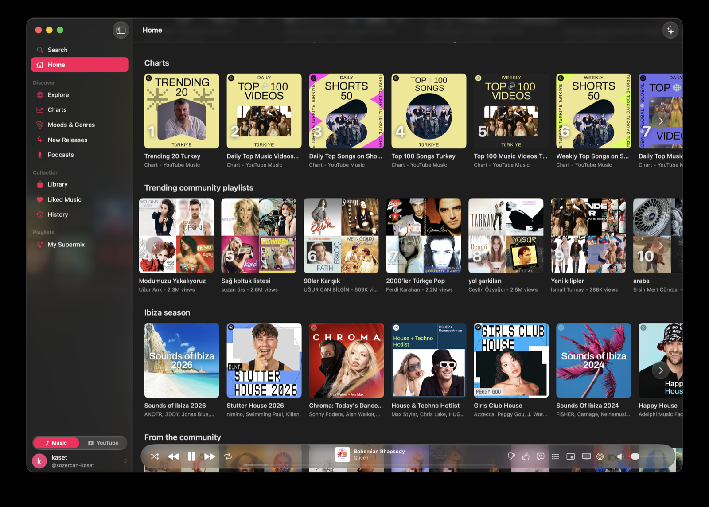
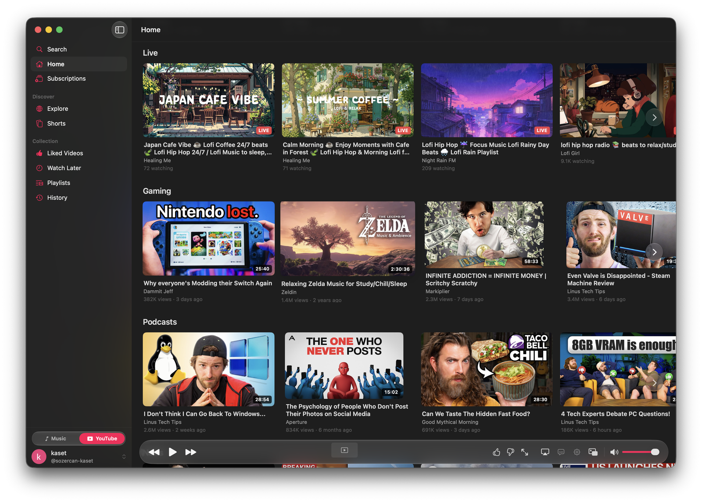

<h1 align="center">Kaset</h1>

<p align="center">A native macOS client for YouTube Music and YouTube, built with Swift and SwiftUI.</p>

<p align="center">
  <a href="https://trendshift.io/repositories/16570?utm_source=repository-badge&amp;utm_medium=badge&amp;utm_campaign=badge-repository-16570"></a>
</p>

<table>
  <tr>
    <th>YouTube Music</th>
    <th>YouTube</th>
  </tr>
  <tr>
    <td></td>
    <td></td>
  </tr>
</table>

## Features

### Music & Video

- 🎵 **Native macOS Experience** — Apple Music-style UI with Liquid Glass player bars, clean sidebar navigation, and a source toggle for Music ↔ YouTube
- 🎧 **YouTube Music Support** — Full playback of DRM-protected YouTube Music content via your existing Premium subscription
- ▶️ **[YouTube Support](docs/youtube.md)** — Browse regular YouTube recommendations, search, subscriptions, Shorts, Watch Later, history, comments, and video playback with native controls, captions, quality selection, and picture in picture

### Playback

- 🎚️ **Equalizer** — System-wide 6-band parametric EQ with Spotify-style presets, applied to WebKit playback output
- 📜 **Lyrics** — View plain and synced lyrics with line-by-line highlighting when timing data is available, plus AI-powered explanations and mood analysis on macOS 26+
- 📃 **Queue Management** — View, reorder, shuffle, and clear your playback queue
- 🔀 **Smart Shuffle** — Beyond plain shuffle: blends suggested tracks into the queue based on what you're playing, with cadence and how many are queued ahead configurable in Settings
- 🔊 **Background Audio** — Music continues playing when the window is closed; stops on quit
- 🎶 **Track Notifications** — Get notified when a new track starts playing

### Library & Discovery

- 📚 **Library Access** — Browse playlists, liked songs, and subscribed podcasts; create playlists, add songs to playlists, and delete your own playlists
- 🧭 **Explore** — Discover new releases, charts, and moods & genres
- 🎙️ **Podcasts** — Browse and listen to podcasts with episode progress tracking
- 🔍 **Search** — Find songs, albums, artists, playlists, and podcasts
- 🕓 **History** — Revisit recently played tracks

### macOS Integration

- 🎛️ **System Integration** — Now Playing in Control Center, media key support, Dock menu controls
- ✨ **Apple Intelligence** — On-device AI for natural language commands, lyrics explanations, and playlist refinement on macOS 26+
- ⌨️ **[Keyboard Shortcuts](docs/keyboard-shortcuts.md)** — Full keyboard control for playback, navigation, and more
- 📳 **Haptic Feedback** — Tactile feedback on Force Touch trackpads for player controls and navigation
- 📣 **Share** — Share songs, playlists, albums, and artists via the native macOS share sheet
- 🌍 **Localized** — UI available in 15 languages (Arabic, Dutch, English, French, German, Indonesian, Italian, Korean, Polish, Portuguese, Russian, Spanish, Swedish, Turkish, Ukrainian); change under Settings → General → Language

### Automation & Extensibility

- 🧩 **[Extensions](docs/extensions.md)** — Load WebKit Web Extensions, including [uBlock Origin Lite](https://github.com/uBlockOrigin/uBOL-home) and [SponsorBlock](https://github.com/ajayyy/SponsorBlock)
- 🔗 **[URL Scheme](docs/url-scheme.md)** — Open songs directly with `kaset://play?v=VIDEO_ID`; app-targeted YouTube watch and `youtu.be` links play in YouTube mode
- 🤖 **[AppleScript Support](docs/applescript.md)** — Automate playback with scripts, Raycast, Alfred, and Shortcuts

## Requirements

- macOS 15.4 or later
- Apple Intelligence features require macOS 26.0 or later
- [Google](https://accounts.google.com) account for YouTube Music and YouTube personalization

## Installation

### Download

Download the latest release from the [Releases](https://github.com/sozercan/kaset/releases) page.

### Homebrew

```bash
brew install sozercan/repo/kaset
```

> **Note:** The app is not signed.
> If you downloaded the app manually, you can clear extended attributes (including quarantine) with:
>
> ```bash
> xattr -cr /Applications/Kaset.app
> ```

## Contributing

See [CONTRIBUTING.md](CONTRIBUTING.md) for development setup, architecture, and coding guidelines.

We welcome AI-assisted contributions! You can submit traditional PRs or **prompt requests** — share the AI prompt that generates your changes, and maintainers can review the intent before running the code. See the [AI-Assisted Contributions](CONTRIBUTING.md#ai-assisted-contributions--prompt-requests) section for details.

## Disclaimer

Kaset is an unofficial application and not affiliated with YouTube or Google Inc. in any way. "YouTube", "YouTube Music" and the "YouTube Logo" are registered trademarks of Google Inc.
