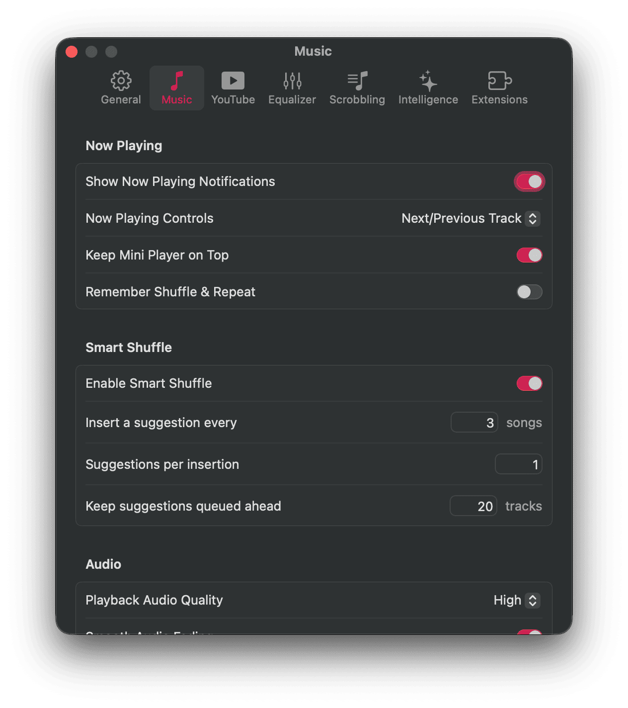

# Kaset — In-Engine Audio Fading

Smooth volume fading and crossfading transitions for Kaset on macOS.

---

## Overview

Abrupt stops and starts during audio playback can feel jarring. This branch adds smooth audio fading directly into the player, easing the volume down when you pause or skip and fading it back in when you hit play.

<p align="left">
  
</p>

---

## Fading Curves & Mathematics

Human hearing perceives volume changes on a curve rather than in a straight line. If you change volume linearly, the music feels like it drops too quickly at the start and hangs around too long at the end. To make transitions feel natural, Kaset uses smooth curve formulas for fading.

For elapsed time $t$ over a target fade duration $T$, progress $p$ from start to finish is:

$$
p = \min\left(1.0, \frac{t}{T}\right) \quad \text{where } p \in [0, 1]
$$

### Volume Rise (Fade-In)
When starting or resuming playback, the volume ramps up from starting level $V_{\text{start}}$ to your set volume $V_{\text{target}}$:

$$
V_{\text{in}}(p) = V_{\text{start}} + (V_{\text{target}} - V_{\text{start}}) \cdot p^{\,2.2}
$$

Using an exponent of $\gamma = 2.2$ gives a gentle initial start that rises smoothly to your normal volume without sudden jumps.

### Volume Decay (Fade-Out)
When pausing, skipping, or seeking, the volume fades down to zero:

$$
V_{\text{out}}(p) = V_{\text{start}} \cdot (1 - p)^{2.0}
$$

A curve exponent of $\gamma = 2.0$ makes sure the music smoothly fades out to silence without any harsh cutoffs at the end.

---

## Key Features

- **Natural Volume Curves**: Uses smooth curve math calibrated for human hearing so fades sound natural.
- **Glitch-Free Controls**: Handles rapid play/pause clicks and quick skips smoothly without volume spikes or audio glitches.
- **Customizable Preferences**: Easily adjust fade duration or turn it off completely in Settings → Music → Audio.
- **Automated Tests**: Backed by unit tests covering curve calculations, rapid button presses, and volume restoration.

---

## Building from Source

```bash
# Clone the feature branch
git clone -b feature/audio-fade https://github.com/httperry/Kaset.git
cd Kaset

# Build the project
swift build

# Package and run the app bundle
./Scripts/compile_and_run.sh --debug
```
