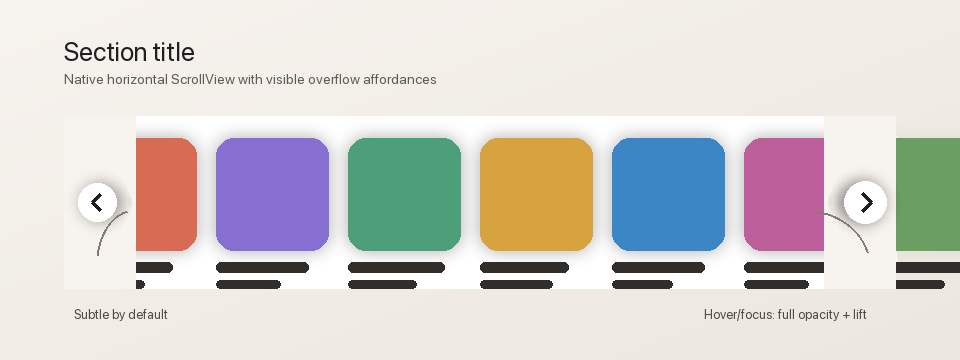

# Issue 251 Carousel Shelf — Phase 1

Reusable shelf treatment for horizontal content rows in Home and Favorites.

## Structure

```text
┌──────────────────────────────────────────────────────────────────────────┐
│ Section title                                                            │
│                                                                          │
│  fade  ◯‹   [ card ] [ card ] [ card ] [ card ] [ card ]   ›◯  fade     │
└──────────────────────────────────────────────────────────────────────────┘
```

## Mockups

- [SVG affordance mockup](carousel-shelf-affordances.svg)
- [PNG affordance mockup](carousel-shelf-affordances.png)



## Behavior

- The shelf remains a native horizontal `ScrollView`, so trackpad/wheel scrolling works normally.
- The page controls call `ScrollPosition.scrollTo(x:)` and move by roughly 85% of the current viewport.
- Leading/trailing fades appear only when additional content exists in that direction.
- Glass chevrons appear only when they can perform an action; hidden controls are not in the accessibility tree.
- Controls remain subtly visible at rest and become fully prominent when the shelf is hovered or a control receives keyboard focus.
- The shared shelf exposes tuning hooks for fade width, page fraction, control visibility, and control vertical alignment.
- Favorites hides shelf controls while a favorite item is being dragged to reduce overlap with drag-and-drop reordering.

Vertical page scrolling remains owned by the parent page scroll view.
